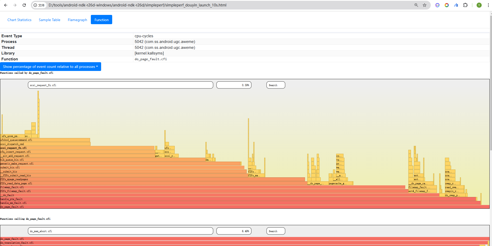

# Simpleperf

工具下载：https://developer.android.com/ndk/downloads?hl=zh-cn

安装教程：http://www.luzexi.com/2020/11/13/%E5%AE%89%E5%8D%93%E6%80%A7%E8%83%BD%E4%BC%98%E5%8C%96%E5%B7%A5%E5%85%B7Simpleperf%E8%AF%A6%E8%A7%A3

使用教程：https://hanpfei.github.io/2017/02/21/Simpleperf_Introduction/

官方文档：https://developer.android.com/ndk/guides/simpleperf?hl=zh-cn

​					https://android.googlesource.com/platform/system/extras/+/master/simpleperf/doc/README.md

https://android.googlesource.com/platform/system/extras/+/master/simpleperf/cmd_stat.cpp


## 安装

1.将simpleperf可执行文件放入安卓系统

```sh
adb push .\ndk21\simpleperf\bin\android\arm64\simpleperf /data/local/tmp
```

2.将可执行文件设置为可执行文件

```sh
adb shell chmod a+x /data/local/tmp/simpleperf
```


## 统计event

ftrace中定义的event都可以在这里统计

```shell
simpleperf list
```

打印event 信息

```shell
simpleperf stat -e raw-dtlb-walk,raw-itlb-walk,raw-l1d-tlb-refill,raw-l2d-tlb-refill,cache-misses,raw-l1d-cache-refill,raw-l2d-cache-refill,raw-l3d-cache-refill,page-faults --app com.ss.android.article.news --duration 120 --interval 2000
```


```shell
# -e:event 其后可以跟多个event,event之间用逗号间隔，ftrace中定义的event都可以在这里统计
# --app:指定跟踪的app，其后跟app的包名，一次只可以指定一个app
# -p:指定跟踪的process，其后跟pid，支持多进程跟踪，多个pid之间用逗号间隔
# --duration：总的统计时间，单位为秒
# --interval：打印统计结果的间隔，单位为毫秒，如果没有这一项，默认是和duration相同
```


event 说明

来自说明文档

```shell
# raw-dtlb-walk：data TLB miss rate
# raw-itlb-walk: instruction TLB miss rate
# raw-l1d-tlb-refill："raw-l1d-tlb", "level 1 data or unified TLB refill rate"
# raw-l2d-tlb-refill："raw-l2d-tlb", "level 2 data or unified TLB refill rate"
# cache-misses
# raw-l1d-cache-refill："raw-l1d-cache", "level 1 data or unified cache refill rate"
# raw-l2d-cache-refill："raw-l2d-cache", "level 2 data or unified cache refill rate"
# raw-l3d-cache-refill："raw-l3d-cache", "level 3 data or unified cache refill rate"
# page-faults
```


## 生成火焰图

```shell
#启动应用并进行分析
blueline:/data/local/tmp # simpleperf record -p 5042 -g --duration 10 -o simpleperf_douyin_launch_10s.data
```


```shell
#生成图形化报告（可选）
D:\tools\android-ndk-r26d-windows\android-ndk-r26d\simpleperf> adb pull data/local/tmp/simpleperf_douyin_launch_10s.data
D:\tools\android-ndk-r26d-windows\android-ndk-r26d\simpleperf> python report_html.py -i simpleperf_douyin_launch_10s.data -o simpleperf_douyin_launch_10s.html
```





