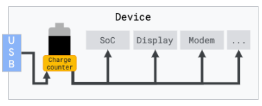

## 简介[1]

## Battery counters

此数据源在 Android 10 (Q) 中引入，并要求设备上存在电源管理硬件。这在大多数 Google Pixel 智能手机上可用。

现代智能手机配备了电源监控集成电路（IC），能够测量流入和流出电池的电量。这使得 Perfetto 能够观察设备整体（包括系统芯片、显示屏、无线电和所有其他硬件单元）从电池中消耗的总电量和瞬时电量。

简化的框图：




### 报告

剩余电池容量（%）。
剩余电池电量（微安时，µAh）。
瞬时电流（通常是小时间窗口内的平均值，微安，µA）。
这些计数器的存在和分辨率取决于设备制造商。在平台层面，这些数据通过轮询 [IHealth HAL](https://cs.android.com/android/platform/superproject/main/+/main:hardware/interfaces/health/2.0/IHealth.hal?q=IHealth) 获得。有关硬件规格和分辨率的更多详细信息，请参见 [Measuring Device Power](https://source.android.com/devices/tech/power/device).。

### 在 USB 插入时测量电量

Battery counters测量流入和流出电池的电量。如果设备连接到 USB 电缆，您可能会观察到正的瞬时电流和总电量的增加，表明电量正在流入电池（即充电），而不是流出。

这可能会使实验室环境中的测量变得复杂。已知的解决方法包括：

使用专门的 USB 集线器，允许从主机侧电气断开 USB 端口。这使得在测试运行时可以有效断开手机。

在已 root 的手机上，电源管理 IC 驱动程序允许在保持 USB 数据链接活动的同时断开 USB 充电。此功能是特定于系统芯片的，未文档化，并且未通过任何 HAL 暴露。例如，在 Pixel 2 上，可以通过以 root 身份运行以下命令实现：

`echo 1 > /sys/devices/soc/800f000.qcom,spmi/spmi-0/spmi0-02/800f000.qcom,spmi:qcom,pmi8998@2:qcom,qpnp-smb2/power_supply/battery/input_suspend`

请注意，在大多数设备上，内核 USB 驱动程序会保持一个 wakelock，以保持 USB 数据链接活动，因此即使关闭屏幕，设备也不会完全挂起。


#### pixel 3

关闭USB充电

```shell
echo 1 > /sys/devices/platform/soc/c440000.qcom,spmi/spmi-0/spmi0-02/c440000.qcom,spmi:qcom,pmi8998@2:qcom,qpnp-smb2/power_supply/battery/input_suspend
```

开启USB充电

```shell
echo 0 > /sys/devices/platform/soc/c440000.qcom,spmi/spmi-0/spmi0-02/c440000.qcom,spmi:qcom,pmi8998@2:qcom,qpnp-smb2/power_supply/battery/input_suspend
```

pixel 6

```shell
#todo
```


## 1.Config

`config_battery.pbtx`

```.pbtx
buffers: {
    size_kb: 522240
    fill_policy: DISCARD
}
data_sources: {
    config {
        name: "android.packages_list"
        target_buffer: 1
    }
}
data_sources: {
    config {
        name: "android.power"
        android_power_config {
            battery_poll_ms: 250
            collect_power_rails: true
            battery_counters: BATTERY_COUNTER_CAPACITY_PERCENT
            battery_counters: BATTERY_COUNTER_CHARGE
            battery_counters: BATTERY_COUNTER_CURRENT
            battery_counters: BATTERY_COUNTER_UNSPECIFIED
            battery_counters: BATTERY_COUNTER_CURRENT_AVG
        }
    }
}
duration_ms: 60000

```


## 2. SQL

### 所有信息

```sql
select * from counter as c left join counter_track t on c.track_id = t.id
```

| id   | type    | ts              | track_id | value   | arg_set_id | id_1 | type_1        | name                | parent_id | source_arg_set_id | machine_id | unit | description |
| ---- | ------- | --------------- | -------- | ------- | ---------- | ---- | ------------- | ------------------- | --------- | ----------------- | ---------- | ---- | ----------- |
| 0    | counter | 588809105319572 | 5        | 1246000 | NULL       | 5    | counter_track | batt.charge_uah     | 4         | NULL              | NULL       | NULL | NULL        |
| 1    | counter | 588809105319572 | 6        | 47      | NULL       | 6    | counter_track | batt.capacity_pct   | 4         | NULL              | NULL       | NULL | NULL        |
| 2    | counter | 588809105319572 | 7        | 134375  | NULL       | 7    | counter_track | batt.current_ua     | 4         | NULL              | NULL       | NULL | NULL        |
| 3    | counter | 588809105319572 | 8        | -151875 | NULL       | 8    | counter_track | batt.current.avg_ua | 4         | NULL              | NULL       | NULL | NULL        |

**`batt.charge_uah`（电池充放电量，微安时 uAh）**:

- **这是电池的剩余电量**，通常是通过电池的容量和当前的电流计算得出的。它表示电池当前储存的电量，单位是微安时（uAh），即表示在一段时间内电流对电池的充电（值为正）或放电（值为负）情况。
-  Battery capacity in microampere-hours(µAh).

**`batt.capacity_pct`（电池量百分比 (%), 显示当前的电池剩余状态。）**

**`batt.current_ua`（当前电流，微安 μA）**:

- 这是当前电池的实际电流，表示瞬时电流的方向和大小。如果值为正，表示电池正在充电；如果为负，表示电池正在放电。电流值对 `batt.charge_uah` 影响直接，因为较大的电流值（无论充电或放电）会更快地影响电池的充电状态。

  **注意**：波动较大

**`batt.current.avg_ua`（平均电流，微安 μA）**:

- 这是在一定时间内的平均电流，表示在过去一段时间里，电池的电流变化趋势。它可以平滑瞬时电流的波动，提供一个更平稳的电流消耗或充电的估计。该值**有助于分析一段时间内电池的整体电流消耗或充电状态**。


### 一段时间内电池耗电量

```sql
select ts, track_id, t.name, value 
from counter as c 
left join counter_track t on c.track_id = t.id
where t.name = 'batt.charge_uah';
```


计算最后一行与第一行的**微安时**之差

```sql
WITH RankedRecords AS (
    SELECT 
        c.ts, 
        c.track_id, 
        t.name, 
        c.value,
        ROW_NUMBER() OVER (ORDER BY c.ts ASC) AS row_asc,
        ROW_NUMBER() OVER (ORDER BY c.ts DESC) AS row_desc
    FROM counter AS c
    LEFT JOIN counter_track AS t ON c.track_id = t.id
    WHERE t.name = 'batt.charge_uah'
)
SELECT 
    MAX(CASE WHEN row_asc = 1 THEN value END) AS first_value,
    MAX(CASE WHEN row_desc = 1 THEN value END) AS last_value,
    (MAX(CASE WHEN row_desc = 1 THEN value END) - MAX(CASE WHEN row_asc = 1 THEN value END)) AS value_difference
FROM RankedRecords;

```


## 3. 手机电池电量说明[2]

一般的[手机电池](https://baike.baidu.com/item/手机电池/7386785?fromModule=lemma_inlink),[充电电池](https://baike.baidu.com/item/充电电池/2300011?fromModule=lemma_inlink)的电量都是毫安时,它的定义是在一定的放电时间下完全放电产生的电流.例如,1300毫安时指此电池在[放电电流](https://baike.baidu.com/item/放电电流/7901767?fromModule=lemma_inlink)为1300毫安情况下能维持1小时完全放电。

## refs

[1] https://perfetto.dev/docs/data-sources/battery-counters

[2] 毫安时.  https://baike.baidu.com/item/%E6%AF%AB%E5%AE%89%E6%97%B6/6764806
