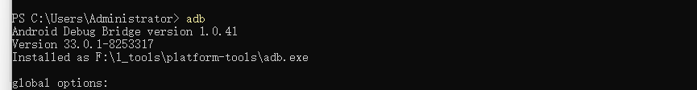
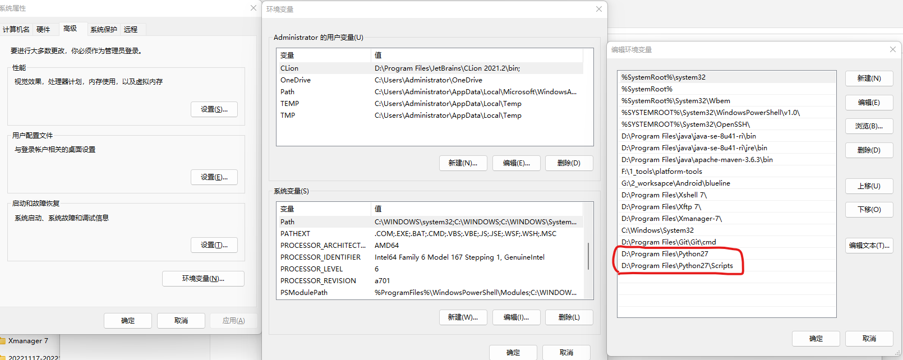

# win11环境使用systrace工具分析手机性能

环境要求

python 2.7

## 1. Systrace工具下载与配置

1)到android官网下载最新版本的[platform-tools](https://developer.android.com/studio/releases/platform-tools),本环境用的`platform-tools_r31.0.3-windows`

2)将platform-tools安装解压，并将其解压后的路径配置到path环境变量，如下图所示。systrace 工具为platform-tools\systrace\systrace.py


测试环境变量是否配置成功

打开PowerShell,输入指令adb,有adb指令即为配置成功




## 2. 切换python版本

systrace.py的python版本为2.7

1）到python[官网](https://www.python.org/downloads/)下载python2.7,本环境用的[2.7.10](https://www.python.org/downloads/release/python-2710/)

2）将python包解压，本环境解压路径为`D:\Program Files\Python`

3）修改python名称：windows环境上可能存在多个python版本，为了便于切换，将python安装包解压后的路径修改为`D:\Program Files\Python`，将`D:\Program Files\Python\python.exe`修改为`D:\Program Files\Python\python27.exe`

4）配置python环境变量，在path环境变量中添加`D:\Program Files\Python27`与`D:\Program Files\Python27\Scripts`




## 3. 其它环境

systrace.py的执行依赖pywin32与six包

1）pywin32安装：

​		方式1：`pip install pywin32`

​		[方式2](https://blog.csdn.net/weixin_43937959/article/details/123095273)：官网下载对应[python2.7版本](https://github.com/mhammond/pywin32/releases/download/b228/pywin32-228.win32-py2.7.exe)，手动安装

2） six安装：`pip install six`


## 4. Systrace工具[使用](https://blog.csdn.net/u011578734/article/details/109497064)

1）生成5s HTML报告：

```python
python27 F:\1_tools\platform-tools_r31.0.3-windows\systrace\systrace.py -t 5 -o F:/1_tools/systrace_data/youku_coldlaunch.html
```


2）用chrome打开生成的html文件


## refs

https://blog.csdn.net/u011578734/article/details/109497064