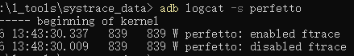
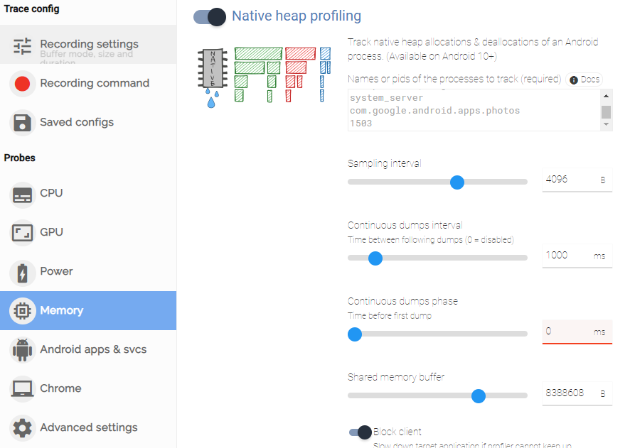
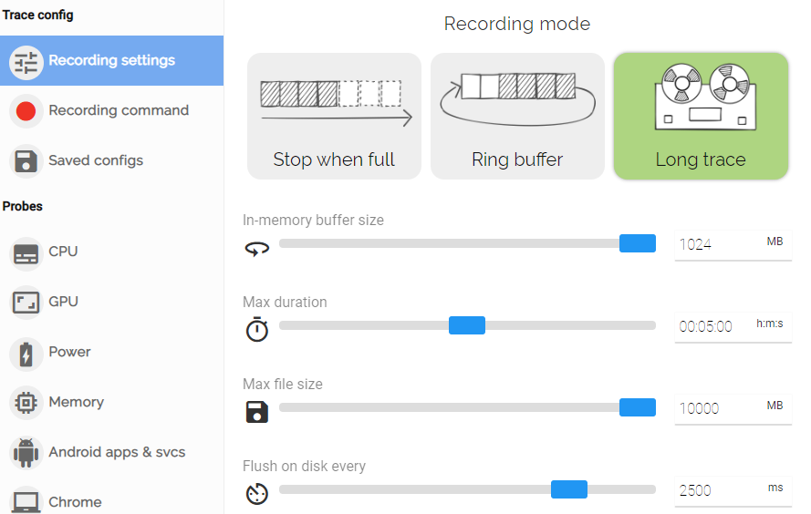

# win11环境用perfetto分析手机性能

环境

pixel 6（oriole）：5.10.43-android12-9-00005

## 1. [简介](https://www.jianshu.com/p/ab22238a9ab1)[1]

Perfetto工具是Android下一代全新的统一的trace收集和分析框架，可以抓取平台和app的trace信息，是用来取代systrace的，但systrace由于历史原因也还会一直存在，并且Perfetto抓取的trace文件也可以同样转换成systrace视图，如果习惯用systrace的，可以用Perfetto UI的"Open with legacy UI"转换成systrace视图来看，Perfetto的几个主要特点如下所示：

- 可以在线抓取长时间的trace，可以长达一个小时，另外抓取的文件size也可以达到GB级别，这样就可以在后台开启，让它一直抓取trace了，特别适用于那种复现概率很低，又比较严重的性能问题。
- 抓取到trace文件之后，它的格式是protobuf或者json，需要用到Perfetto的一个C++库，这个库可以基于protobuf或者json提供出来一个SQL语言操作的接口，这个C++库可以基于命令行，也可以集成到其他工具中，后面会有相关介绍。
- Perfetto具有很好的可扩展性，它除了提供标准的tracepoints之外，例如CPU调度信息，内存信息等，还可以通过atrace HAL层扩展，在Android P当中，Google新增加了一个atrace HAL层，atrace进程可以调用这个HAL的接口来获取当前的扩展信息，相关代码可见[Google 提交](https://links.jianshu.com/go?to=https%3A%2F%2Fandroid-review.googlesource.com%2Fc%2Fplatform%2Fframeworks%2Fnative%2F%2B%2F770934)，这样如果需要扩展tracepoints的话，就可以按照graphic的示例添加即可。
- 提供全新的[Perfetto UI](https://links.jianshu.com/go?to=https%3A%2F%2Fui.perfetto.dev%2F%23!%2F)网站，可以在上面通过选取开关的方式，自动生成抓取trace的命令，同时可以打开trace文件，自动把protobuf或者json转变成UI，另外还集成了几种预定义的trace分析统计工具，详情可见它的 *Metrics and auditors* 选项。
   Perfetto本身是一个框架，关于它的架构和模块的详细介绍，有兴趣的可以参考它的[doc网站](https://links.jianshu.com/go?to=https%3A%2F%2Fdocs.perfetto.dev%2F%23%2F%3Fid%3Dperfetto-performance-instrumentation-and-tracing)，它的源码可以参考Android Source Tree的 */external/perfetto* 目录，里面有很多的tools和脚本，可以拿来直接使用，本文只对这个工具做简单的使用介绍。


## 2. [perfetto使用](https://perfetto.dev/docs/quickstart/android-tracing)[2]

**1）启动traced和traced_probes这两个进程**

Perfetto基于Android 9 (P)以来可用的平台服务，但仅在Android 11 (R)后默认启用。在Android 9 (P)和10 (Q)上，需要执行以下操作以确保在开始之前启用跟踪服务:

```shell
adb shell setprop persist.traced.enable 1
```

检查是否启动成功

```shell
adb logcat -s perfetto
```




**2）根据自己的需求设计配置文件xxx.pbtx**

目前最方便的配置文件生成方式是使用官网[Perfetto UI](https://ui.perfetto.dev/#!/record)来帮助生成，还可以通过官方提供的[配置示例](https://cs.android.com/android/platform/superproject/+/master:external/perfetto/test/configs/)[3]自己写配置文件；

- 进入[Perfetto UI](https://ui.perfetto.dev/#!/record)网站，点开Perfetto UI的"Record new trace"之后，选择对应的设备，比如pixel 6 对应的是 `AOSP on Oriole`


- 选择不同trace的探针，比如Memory；



- 设置trace时长与抓取数据大小，点击点击`Recording setting`按钮，若trace的时间较长，比如超过5min，推荐选择`long trace`,这种方式可以每隔一段时间将trace数据落盘，不建议ring buffer,若trace数据比较多,新数据会覆盖老数据；




- 保存配置文件，点击`Recording command`按钮，生成配置文件，复制配置文件内容，保存到本地，并命名为xxx.pbtx。

**3）开始trace**

- 将配置文件放入手机；

```shell
adb root
adb push .\xxx.pbtx /data/misc/perfetto-configs
```

- 开启trace线程；

```shell
adb root
adb shell
cd /data/misc/
perfetto -c perfetto-configs/config_cpu_mem.pbtx --txt -o /data/misc/perfetto-traces/douyin_coldlaunch_10bg.perfetto-trace
```

然后，就可以对手机进行操作了，perfetto会在后台监控配置文件中的探针进行trace，待trace时间结束之后,将trace数据写入指定文件xxx.perfetto-trace，比如douyin_coldlaunch_10bg.perfetto-trace。

**4）trace 可视化**

- 将xxx.perfetto-trace文件拉到本地；

```shell
adb pull /data/misc/perfetto-traces/douyin_coldlaunch_10bg.perfetto-trace .
```

- 进入https://ui.perfetto.dev/网站，点击`Open trace file`按钮，打开3）中生成的xxx.perfetto-trace，耐心等待1-2min，待服务器处理数据

## 3. [perfetto trace结果分析[4]](https://blog.csdn.net/feelabclihu/article/details/126672666)

[Perfetto UI](https://ui.perfetto.dev/)对`xxx.perfetto-trace`文件的分析呈现在`Current Trace`主要分为以下四个部分：

- Show timeline：CPU、Mem等随着时间的变化信息
- Query(SQL)：暂时不了解
- Metrics：各类统计信息
- Info and stats: trace 配置、trace进程及`xxx.perfetto-trace`文件信息


## refs

[1]Perfetto工具使用简介,HuangTao_Zoey,https://www.jianshu.com/p/ab22238a9ab1. 2019.08.19.

[2]Perfetto Docs. https://perfetto.dev/docs/quickstart/android-tracing.

[3] https://cs.android.com/android/platform/superproject/+/master:external/perfetto/test/configs/.

[4] Perfetto分析进阶，内核工匠（Oppo）, https://blog.csdn.net/feelabclihu/article/details/126672666. 2022.09.02.